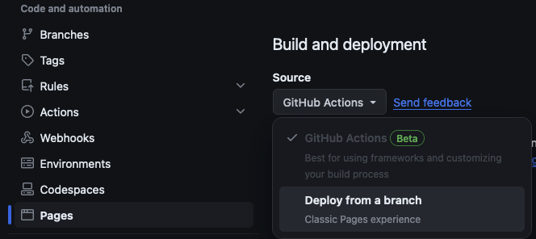
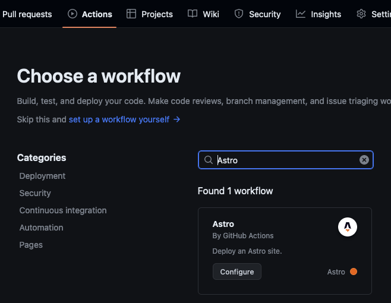

## Building This Website

In 2020, I taught myself enough JavaScript and React to hack together a simple personal website. It was a good project to learn some very basic webdev--a type of programming I didn't have any experience with--and build something to help with my job search. Then after trying to figure out how to deploy it, I ported it website over to [Next.js](https://nextjs.org/) so I could deploy it for free with Netlifly.

That brief look into the chaos of a thousand competing framesworks, a hundred different ways was enough webdev for me and I didn't touch it for several years.

## The New Website

Four years later, I got the itch to go make a new personal website.
[Astro](https://astro.build/) caught my eye as an exciting framework that didn't require as much JavaScript as React to get a website up and running;
I found it wild how heavy even a basic website could become when a JavaScript DOM was driving page.
I ran through the tutorial and played around with the framework. I found it that it made a lot of sense and was fun to work with.

## Creating an MVP-website

I started this website 4-5 times was because I kept learning about new technologies and trying to get fancy despite not being experienced in this field.
At various points over the past few weeks I found myself:

1. Trying build the entire website from scratch but make it look as pretty as professional sites
2. Googling "do I need a CSS framework" and "best CSS framework"
3. Learnng Svelte without knowing why I was learning it
4. Trying to shoe-horn in CSS from a cool template into my from scratch website
5. Scrapping the from scratch website and trying to build on a fancy template
6. Finding a new template I liked better and starting the process all over again
7. Not quite liking the template and trying to modify it without understanding the other frameworks they used

After starting some form of this project 4-5 times, I decided to just go simple and ship an MVP, Minumum Viable Personal-website. Success for this project means that I can go to sebastiansimmons.com and see some html.

I went simple and used the built-in [Astro blog template](https://github.com/withastro/astro/tree/latest/examples/blog).

I did a pass to replace all the boilerplate and make it technically mine. That took about 5 minutes to get something I would be fine with deploying as an MVP.

## Deploying to the World

With the barest of bones website built, the next step in project Minimum Viable Personal-website was to deploy it to the world.

I looked at [Netlifly's free tier](https://www.netlify.com/github-pages-vs-netlify/), which I've used in the past, but I decided to deploy through GitHub Pages since that process was even simpler; if I ever need the more robust features that Netlifly free tier offers over GitHub Pages free page, it should be an easy switch.

GitHub Actions already had a workflow for deploying an Astro site so I just switched the deploy method to that action.

All you have to do is set the Build and Deployment Source to GitHub Actions

and then add the Astro workflow by GitHub pages to the repos actions.

After waiting a minute for the build to complete, https://sebastiansimmons.github.io/ was online!

### Custom Domain

But I don't want to just leave it as a github.io page.
Time to go mess with DNS settings!

GitHub Pages has easy to follow [documentation](https://docs.github.com/en/pages/configuring-a-custom-domain-for-your-github-pages-site/about-custom-domains-and-github-pages) for setting a custom domain and updating your DNS records.

The longest part of the process is waiting for records to update. If you've ever tried to test out your custom email address, you know the struggle of this wait time.

### It's Online!

Wow, a personal website just for me! This counts as a successful Minumum Viable Personal-website. 

### Let's Actually Customize It

This success lets me do what I actually want do to which is customize the site a little bit and learn a few things along the way.

I decided to two small features to the blog to wrap up the evening. First I reversed the default sorting so that the newest posts showed up first.

#### Draft Blog Posts

Next, I added a `draft` field in frontmatter of markdown blog posts. The __Blog__ page hides all pages with `draft == true`. Simple and useful!

#### Future Date Publishing

The next feature I wanted to add was publishing pages based on the `pubDate` field. If `pubDate` is in the future, hide that post until it's the present.

This was another simple frontmatter filter, but that's enough for me to feel like I technically customized the website to fit my needs.

I don't even have a use for this yet.

#### Small CSS Changes

I did some simple things like push the footer to the bottom and fudge a few values in the CSS to my liking. 

## It's Live!

A personal website made over the course of an evening. That's pretty cool.

Thanks for reading!
